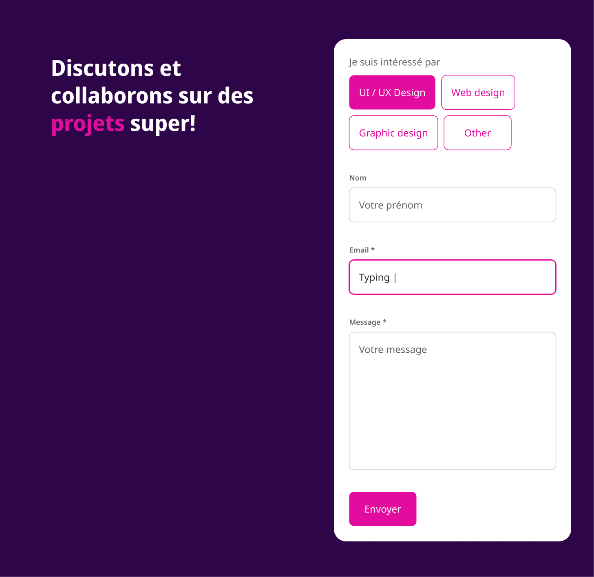

# Exercice Form Basics

## Objectif

Avec vos connaissances actuelles, vous devez créer un formulaire de contact pour un site web.

## Instructions

### En HTML

- Balise `<input type="text">` pour le champ de texte
- Balise `<input type="email">` pour le champ d'email
- Balise `<button type="submit">` pour le bouton d'envoi
- Balise `<textarea>` pour le champ de texte

### En CSS

- Utiliser Flexbox pour aligner les éléments
- Utiliser une police Google Font pour le texte
- Prévoyez les différents états des éléments
  - Focus (:focus)
  - Hover (:hover)
  - Active (:active)
- Voilà comment créer un bouton radio avec des styles personnalisés

```html
<label for="radio">
  <input type="radio" id="radio" name="radio" value="1" />
</label>
```

```css
input[type="radio"] {
  display: none;
}

label {
  border: 1px solid #000;
  padding: 10px;
}

label:has(:checked) {
  background-color: #000;
  color: #fff;
}
```

## Rendu final

➡️ [Maquette Figma](https://www.figma.com/design/LE9yPmyg8FBsw4g5AE7n8r/HTML-Form-basics?node-id=1-16&t=yPI1jDACgmMkjWJ8-1)


